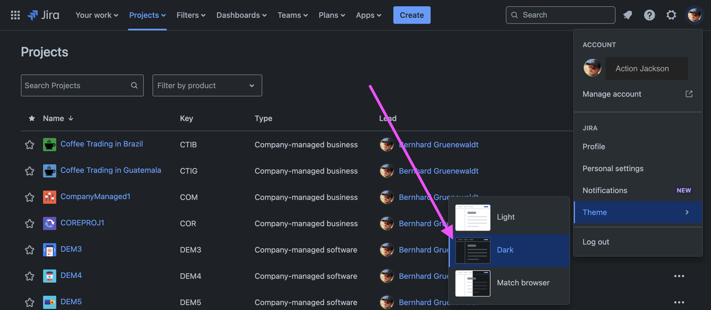
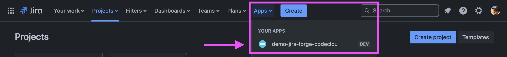
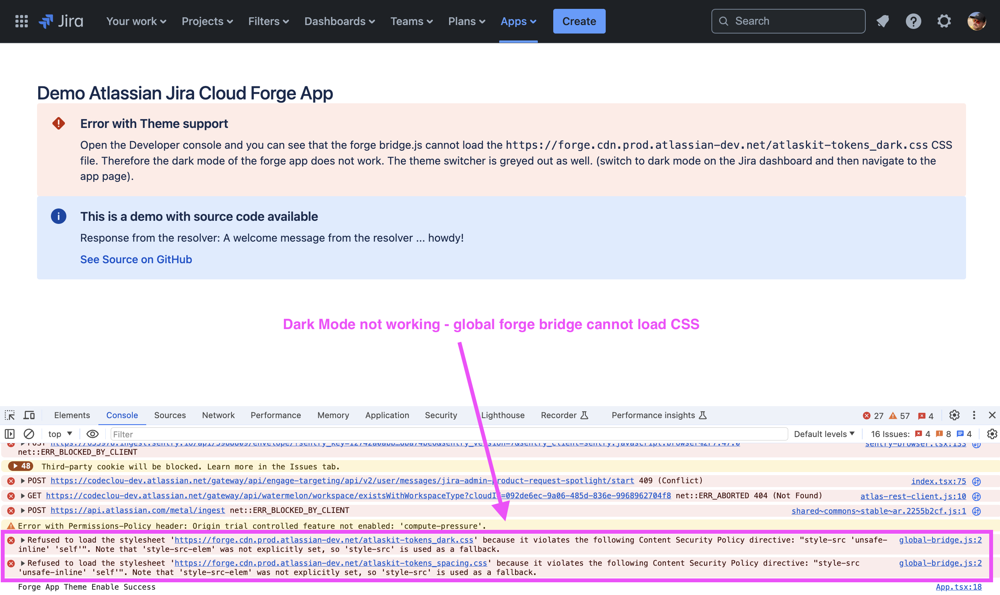

# demo-atlassian-jira-cloud-forge-app

This is a demo repository to show the broken Theme Support in the Atlassian Jira Forge App on a globalPage module.

### How to Build and Deploy

(1) install latest forge CLI

```
npm install -g @forge/cli@latest
```

(2) Change the appId to a unique one

```
vim packages/backend/manifest.yml
# change me:
app:
  id: ari:cloud:ecosystem::app/e46b1f9e-7fbb-441e-bb77-39bf4e38a4e7
```

(3) build frontend

```
cd packages/frontend
npm install
npm run build
```

(4) deploy backend

```
cd packages/backend
npm install
forge deploy
forge install
```

### Reproduce the failure with Dark Mode

(1) Switch to dark mode on the Jira Dashboard



(2) Go to the app global Page



(3) Open Developer Console and see the forge bridge CSS loading errors


